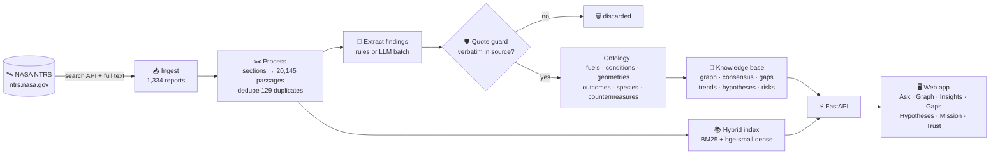
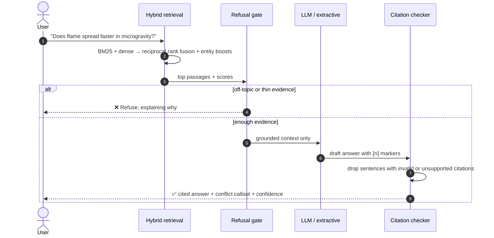
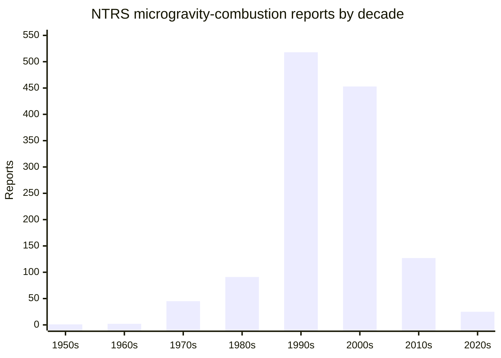
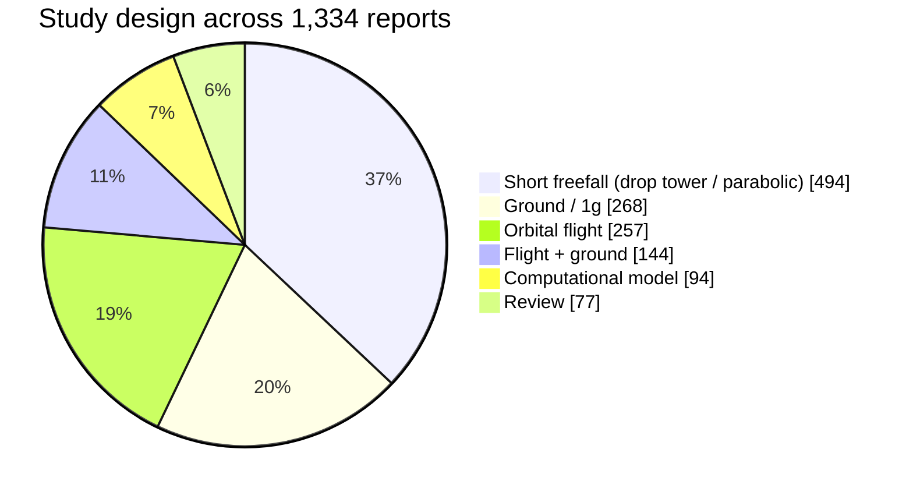
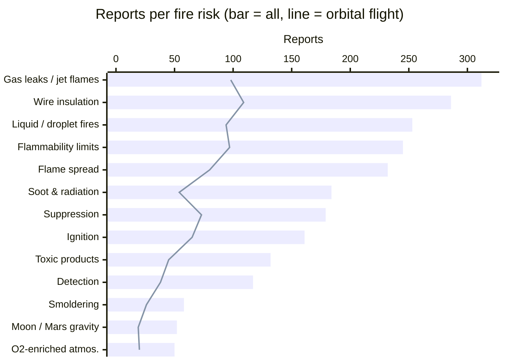
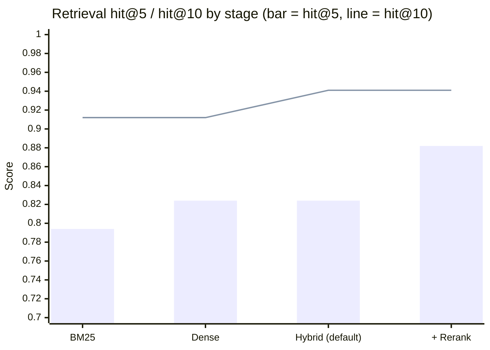

<div align="center">


# Emberfall

### Flame in Freefall: 70 years of NASA fire-safety research in one cited, mission-aware knowledge engine

[](https://www.spaceappschallenge.org/)
[](https://ntrs.nasa.gov/)
[](./LICENSE)


**Team runtime-terror** · *AI-Powered Fire Safety Insights from Microgravity Combustion Data*

[Live demo](#) · [Demo video](#) · [Space Apps project page](#) · [Quick start](#-run-it-in-3-commands)

</div>

---

> **Why this challenge?** Fire in space behaves differently. Without gravity there is no buoyancy, so flames don't rise. They grow into slow, blue, near-invisible spheres, and they can keep burning in conditions where they would go out on Earth. Crews can't evacuate, and the air supply is a closed loop. Artemis habitats plan to run with **more oxygen at lower pressure**, which makes materials easier to ignite. NASA has studied this since the 1950s, but the findings are spread across **more than a thousand technical reports**.
>
> **Emberfall answers one question:** *What do we actually know about fire in freefall, how sure are we, and where are the gaps that matter for crew safety?*

<table>
<tr>
<td align="center"><h2>1,334</h2>NASA NTRS reports</td>
<td align="center"><h2>20,145</h2>indexed passages</td>
<td align="center"><h2>1,812</h2>quote-verified findings</td>
<td align="center"><h2>58</h2>open contradictions found</td>
<td align="center"><h2>1955–2026</h2>literature span</td>
</tr>
</table>

---

## 🚀 The challenge and how we answer it

The challenge asks for an AI tool that turns NASA's microgravity combustion data into fire-safety insights. The table below maps each part of that ask to what we built.

| The challenge asks for… | Emberfall delivers… | Where |
|---|---|---|
| Make microgravity combustion research **accessible** | Cited Q&A over 1,334 NTRS reports, plus plain-language summaries and a glossary | `Ask` · `Reports` · `Glossary` |
| **AI-powered insights**, not just search | Automatic consensus/conflict detection, coverage-gap matrices, literature-based hypotheses | `Insights` · `Gaps` · `Hypotheses` |
| Relevance to **spacecraft fire safety** | 13 NASA-style fire risks scored against the evidence for ISS / Artemis / Mars cabin atmospheres | `Mission` |
| **Trustworthy** outputs | Every sentence is cited and checked; a verbatim quote guard; off-topic or thin-evidence questions are refused | `Trust` (`/eval`) |
| Serve **scientists, engineers, and the public** | Four personas, each with its own entry point and framing | [Who it's for](#-who-its-for) |

**Hero workflow:** a habitat architect picks **Artemis** (or enters a custom O₂ %, pressure, and number of freefall / partial-g days) and gets back a ranked fire-safety briefing. Each risk comes with its evidence strength, supporting quotes, countermeasures, open contradictions, and untested conditions. The briefing exports to PDF.

> ⚠️ Emberfall helps decide which research to prioritize. It is **not** a certified hazard analysis.

---

## 🔥 How it works



### Answering a question without hallucinating



---

## 📊 What the NASA record shows

### Research activity over time

Most microgravity combustion work dates from the Shuttle and early-ISS era, which is exactly why it is hard to find today.



### Where the evidence comes from

Most results come from **drop towers and parabolic flights**, which give seconds of freefall. Orbital experiments that burn for minutes to hours are far fewer. Emberfall tags every report with its platform so that answers say how the evidence was obtained.



### Mission fire risks and how much of the evidence is from flight

For each of 13 risk categories we count supporting reports and how many of them used real orbital flight data. **Oxygen-enriched atmospheres** and **Moon/Mars partial gravity** are the two areas Artemis depends on most, and they have the least evidence.



### Named flight experiments linked to the corpus

`Saffire` (24 reports) · `SSCE` (16) · `DCE` (15) · `LSP` (11) · `SOFBALL` (10) · `FSDC` (8) · `FEANICS` (8) · `BASS` / `BASS-II` (8 each) · `Saffire-IV` (8) · plus FLEX, ACME, CIR and others. In total, **125 reports** are linked to named experiments and **157** to specific missions (STS, USML, Cygnus NG…).

### Example of a conflict the tool surfaces

> **Microgravity × flame spread rate:** 33 papers, of which **17 say it increases** and **16 say it decreases**.
> Emberfall shows quotes from both sides and the likely reasons they disagree: fuel thickness, opposed vs. concurrent flow, freefall duration, and O₂ level. That makes it clear which experiment would settle the question.

---

## 🧭 Who it's for

| Persona | Starts at | Gets |
|---|---|---|
| 🧑‍🔬 **Combustion scientist** | Ask · Graph · Hypotheses | Answers that account for test method: species/soot, test counts, freefall duration |
| 🛡️ **Safety manager** | Gaps · Insights · Trends | Portfolio view of which topics are well studied, thin, or contradictory |
| 🏗️ **Habitat architect** | Mission briefing | Risk → evidence → countermeasure, in plain language, exportable as PDF |
| 🎓 **Student / public** | Ask · Glossary · Reports | Plain-language entry into a dense NASA technical archive |

## 🧰 Feature tour

| Surface | What it does |
|---|---|
| **Ask** | Hybrid BM25 + dense retrieval. Every sentence is cited `[n]` and verified. Includes claim-support scores, confidence, follow-up questions, filters, share links, and 👍/👎 feedback. |
| **Reports** | Browse 1,334 NTRS reports. Filter by fuel, condition, geometry, study design, and experiment. Multi-level summaries and BibTeX / RIS / CSV export. |
| **Graph** | Knowledge graph with 91 entities and 590 relations. Year filter, evidence paths between concepts, PNG/JSON export. |
| **Insights** | 34 topics where studies agree and 58 where they conflict, with the vote split, quotes on each side, and likely reasons for the disagreement. |
| **Gaps** | Coverage matrices (fuel / geometry / outcome × condition), lab-fuel vs. spacecraft-material bias, freefall test duration vs. real cabin-fire duration. |
| **Hypotheses** | Literature-based discovery: if A–B and B–C are both studied but A–C never is, it proposes an experiment and names the papers that connect them. |
| **Mission** | ISS / Artemis / Mars presets or a custom atmosphere → ranked risks, readiness, countermeasures → **PDF**. |
| **Glossary** | Plain-language terms about fire in freefall, each linked into Ask. |
| **Trust** | Live evaluation dashboard (see below). |

---

## 🛡️ Trust and evaluation

Safety research needs a tool that says "I don't know" when the evidence isn't there. We measure that directly with `make eval` on a gold set of **40 questions (34 answerable, 6 deliberately unanswerable)**.

| Metric | Score |
|---|---:|
| Refusal accuracy (unanswerable questions) | **100%** |
| Citation validity | **100%** |
| Faithfulness / supported sentences | **100%** |
| Quote guard (1,954 / 1,954 extractions verified) | **100%** |
| Retrieval hit@1 / hit@5 / hit@10 | 0.56 / 0.82 / **0.94** |
| MRR | 0.70 |
| Median latency (extractive) | 23 ms |



Retrieval relevance is judged by topic regexes over report titles. This measures whether the right topic is retrieved, not whether the exact paper is. Human extraction labels are in `backend/eval/extraction_labels.csv`.

---

## 🛰️ NASA data

| Source | Role |
|---|---|
| **[NASA Technical Reports Server (NTRS)](https://ntrs.nasa.gov/)** search API | Core corpus of microgravity combustion and spacecraft fire-safety reports |
| **NTRS extracted full text** | Report body split into sections, used for retrieval and extraction (917 reports have usable text) |
| **Named flight experiments** | Saffire, BASS, FLEX, ACME, SSCE, DCE, CIR, and STS/USML/Cygnus mission links |
| **Cabin atmospheres** (curated) | ISS, Artemis (elevated O₂ / reduced pressure), and Mars presets |
| **NASA fire-safety risk framing** | Flammability, spread, detection, toxicity, suppression, partial-g, crew autonomy |

Most reports come from **Glenn Research Center** (685), followed by JSC (68), MSFC (53), and others. Provenance, query list, and licensing are in [`SOURCES.md`](./SOURCES.md), and the data audit is in [`data/AUDIT.md`](./data/AUDIT.md). The built knowledge base in `data/kb/` is **committed**, so a fresh clone runs without re-fetching NTRS.

## 🤖 AI disclosure

Space Apps asks teams to disclose AI use. Here is ours:

| Component | Tool | Notes |
|---|---|---|
| Dense embeddings | `BAAI/bge-small-en-v1.5` via fastembed | Runs locally, no cloud needed |
| Sparse retrieval | BM25 (`bm25s`) | Fused with dense results via RRF + entity boosts |
| Optional rerank | Cross-encoder | Off by default (`EMBER_RERANK=1`) |
| Optional generative answers | Gemini (`gemini-flash-latest`) or Claude (`claude-opus-5-5`), with Groq (`llama-3.3-70b-versatile`) as backup | Constrained to retrieved passages and citation-checked |
| Optional batch extraction | Claude Message Batches API | Offline (`make extract` / `make collect`) |
| **Default with no API keys** | **Extractive mode** | Answers are only cited sentences taken from the reports |

---

## ⚡ Run it in 3 commands

**Requirements:** [uv](https://docs.astral.sh/uv/), Node 20+, [pnpm](https://pnpm.io/).

```bash
git clone https://github.com/0xdevabir/runtime-terrors.git && cd runtime-terrors
make setup     # backend (uv) + web (pnpm)
make dev       # API :8000 + web :3000  →  open http://localhost:3000
```

<details>
<summary><b>More commands, LLM keys, and deployment</b></summary>

| Command | Purpose |
|---|---|
| `make embed` | Dense embeddings if missing (~30 min on CPU, resumable) |
| `make data` | Full NTRS fetch → process → build KB (1–3 h; only needed if `data/kb` is missing or stale) |
| `make test` | Backend unit tests |
| `make eval` | Retrieval / refusal / citation / faithfulness metrics → `data/kb/eval_results.json` |
| `make up` | Full stack via Docker Compose |

**Optional LLM answers:** copy `backend/.env.example` → `backend/.env` and set `GEMINI_API_KEY` or `ANTHROPIC_API_KEY`, plus `GROQ_API_KEY` as a backup. To force a provider, set `EMBER_LLM=gemini|claude|groq`.

**Deploy:** `make docker` builds the `emberfall-api` image (it bundles `data/kb` and the embedding model). Deploy `web/` (e.g. on Vercel) with `API_URL=https://<your-api>`. For cross-origin setups, set `NEXT_PUBLIC_API_URL` and add the origin to `EMBER_CORS`.

</details>

<details>
<summary><b>Tech stack and project layout</b></summary>

| Layer | Choice |
|---|---|
| API | Python 3.12, FastAPI, uvicorn, NetworkX, NumPy, Pydantic, SSE |
| Pipeline | httpx, bm25s, fastembed, rapidfuzz, optional Anthropic / Gemini / Groq |
| Web | Next.js 16, React 19, Tailwind CSS v4, Cytoscape.js + fcose |
| Ops | Make, Docker Compose, uv, pnpm |

```
runtime-terror/
├── backend/
│   ├── pipeline/   # ntrs → process → extract → ontology → build → embed
│   ├── app/        # FastAPI: retrieval, answer, mission, export, glossary
│   ├── eval/       # gold questions, extraction labels, run_eval.py
│   └── tests/
├── web/            # Next.js app
├── data/kb/        # committed knowledge base (no database needed)
├── SOURCES.md      # NASA data provenance
└── PLAN.md         # design notes and deviations
```

</details>

---

## 🎬 Two-minute demo

| Time | Beat |
|---|---|
| **0:00** | **Problem:** 1,300+ NASA reports on fire in freefall, and designers can't see what is known, what conflicts, or what is missing. |
| **0:15** | **Mission:** habitat architect → **Artemis** briefing → ranked risks, evidence bars, a flame-spread contradiction → export PDF. |
| **0:50** | **Ask:** microgravity flame spread → citations, conflict callout, confidence. |
| **1:15** | **Gaps + Graph:** spacecraft materials × elevated O₂ is barely tested; follow the evidence path on the graph. |
| **1:35** | **Trust:** ask something off-topic → refusal; open `/eval`. |
| **1:50** | **Close:** one evidence base for scientists, managers, and architects, grounded in NTRS. |

## 🌍 Impact

- **NASA & partners:** faster literature triage, plus an explicit map of contradictions and under-tested conditions *before* committing to expensive flight experiments.
- **Artemis & Mars planning:** risk briefings for a specific mission, tied to real report quotes instead of generic chatbot text.
- **Students & public:** an accessible way into a historically dense NASA archive.
- **Open science:** a reproducible NTRS pipeline, committed KB, published eval harness, and MIT-licensed code.

### What's next

- [ ] LLM batch extraction across the full corpus to capture effect sizes and atmospheres in more detail
- [ ] Gap campaigns on partial gravity and elevated O₂, with scientists labeling results
- [ ] Hosted public demo, with TechPort and standards cross-links
- [ ] A larger gold question set and human spot-checks of faithfulness

---

## 👩‍🚀 Team runtime-terror

| Name | Role |
|---|---|
| *[add]* | *[add]* |
| *[add]* | *[add]* |

Local event: *[add]* · Contributing: [`CONTRIBUTING.md`](./CONTRIBUTING.md). We put grounding first, so please run `make eval` whenever you change retrieval or answer logic.

## 🙏 Acknowledgments

- The NASA Technical Reports Server, and the researchers who have spent decades on microgravity combustion and spacecraft fire safety.
- The flight programs **Saffire**, **BASS**, **FLEX**, **ACME**, **SSCE**, **DCE**, and the related ISS and Cygnus efforts.
- The [NASA Space Apps Challenge](https://www.spaceappschallenge.org/), whose brief pushed us from "search the PDFs" to an evidence workflow built around missions.

## 📜 License

**Code:** MIT, see [`LICENSE`](./LICENSE).
**Data:** Report text belongs to its authors and NASA. It was fetched from the public NTRS under each record's distribution terms. Do not redistribute PDFs under publisher copyright. The derived `data/kb/` is for research and educational use.

<div align="center">

*Emberfall: in freefall, fire doesn't rise, and neither should uncertainty.* 🔥🛰️

</div>
